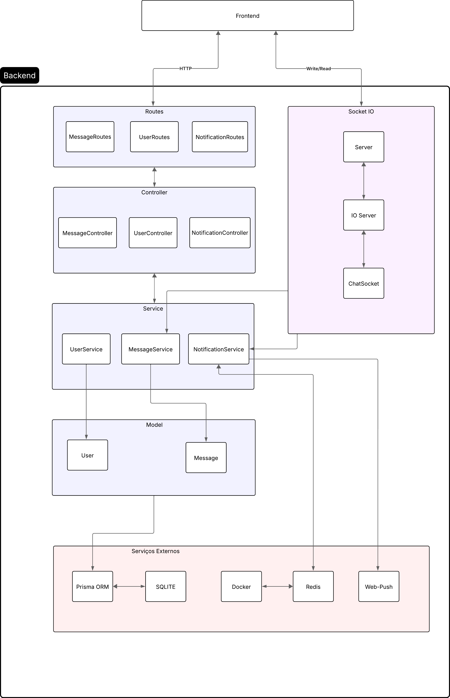

# Aplicação Webchat
## Programação para web II 2025.1

## Sumário

- [Equipe](#equipe)
- [Descrição da Atividade](#descrição-da-atividade)
- [Decisões técnicas adotadas](#decisões-técnicas-adotadas)
- [Arquitetura](#arquitetura)
- [Executando o projeto](#executando-o-projeto)
- [Documentação](#documentacao)

## Equipe

- [Gabriella](https://github.com/gabs44)
- [Maria Clara](https://github.com/marysclair)
- [Maurício](https://github.com/maueici0)

## Descrição da Atividade

Este repositório contém o backend da aplicação WebChat, desenvolvida como parte da disciplina de Programação para Web II, com o objetivo de demonstrar na prática os principais conceitos estudados. O frontend dessa aplicação pode ser acessado [aqui](https://github.com/g4ma/Frontend-Chat-PWII)


## Decisões Técnicas Adotadas

- Express 

Optamos pelo Express por ser um framework minimalista, flexível e amplamente utilizado no ecossistema Node.js. Ele oferece a estrutura necessária para criar rotas, middlewares e integrações de forma simples, além de contar com uma comunidade ativa que facilita a resolução de problemas.

- TypeScript 

A decisão de usar TypeScript foi tomada para aumentar a robustez do backend com tipagem estática, reduzindo erros comuns em tempo de execução e tornando o código mais legível e seguro para manutenção a longo prazo.

- Comunicação em tempo real com WebSocket (socket.io)

Para a funcionalidade de chat, escolhemos o WebSocket, que garante comunicação bidirecional e em tempo real, essencial em uma aplicação de mensagens. A biblioteca socket.io foi adotada para abstrair a implementação, simplificar a reconexão automática, lidar com fallback em caso de falha e oferecer uma API mais prática do que a implementação nativa de WebSocket.

- Push Notifications com web-push

A biblioteca web-push foi utilizada para gerenciar o envio de notificações pelo protocolo Web Push Protocol, abstraindo detalhes como criptografia e autenticação de mensagens. Isso garantiu confiabilidade e segurança no envio das notificações aos navegadores.

- Gerenciamento de inscrições com Redis

Inicialmente, as inscrições de usuários eram mantidas em memória local, o que não era escalável em cenários de múltiplos servidores. Por isso, adotamos o Redis, um banco de dados em memória com alta performance, permitindo gerenciar inscrições de forma persistente e eficiente. Essa decisão foi crucial para garantir escalabilidade horizontal da aplicação.

- Execução do Redis com Docker

Para padronizar ambientes e facilitar a configuração entre diferentes máquinas de desenvolvimento, utilizamos o Docker para executar o serviço do Redis. Essa decisão eliminou dependências manuais, simplificou a inicialização do projeto e aumentou a reprodutibilidade em diferentes sistemas operacionais.

- Prisma ORM com SQLite

Para persistência de dados, escolhemos o Prisma como ORM devido à sua tipagem forte, suporte a migrações automáticas e facilidade de integração com TypeScript. O SQLite foi adotado por ser um banco de dados leve e embutido, adequado para o escopo do projeto acadêmico, sem a necessidade de um servidor dedicado.

## Arquitetura



A arquitetura do sistema é dividida em frontend e backend, interligados tanto por requisições HTTP quanto por comunicação em tempo real via WebSocket.

No backend, a estrutura segue um padrão em camadas:

- A camada de rotas (Routes) define os pontos de entrada da aplicação, com rotas específicas para mensagens, usuários e notificações.

- Essas rotas direcionam as requisições para a camada de controllers (Controller), responsável por orquestrar a lógica de cada funcionalidade. Nela estão os controladores de mensagens, usuários e notificações.

- Em seguida, a lógica de negócio é centralizada na camada de serviços (Service), que encapsula as regras específicas de cada domínio: UserService, MessageService e NotificationService.

- Esses serviços interagem com a camada de modelos (Model), que representa as entidades principais da aplicação, como User e Message.

Para persistência e integração com serviços externos, o backend utiliza diferentes ferramentas:

- O Prisma ORM interage diretamente com o banco de dados SQLite, simplificando consultas e mapeamento objeto-relacional.

- O Redis, executado em container via Docker, é responsável por armazenar de forma performática as inscrições dos usuários para notificações, garantindo escalabilidade.

A biblioteca Web-Push é utilizada para envio das notificações.

Além da arquitetura baseada em rotas e serviços, o sistema conta com um módulo de Socket.IO, que gerencia a comunicação em tempo real entre cliente e servidor. Esse módulo é composto por um servidor dedicado (Server), um gerenciador de conexões (IO Server) e um manipulador específico para as interações do chat (ChatSocket). É por meio desse fluxo que ocorre a troca de mensagens instantâneas entre os usuários.

## Executando o projeto

Para executar este projeto, execute os seguintes passos:

1. Baixa as depêndencias node com `npm i`
1. Dê o comando `npx prisma migrate dev --name init` para iniciar o banco com o prisma
1. Em seguida, execute o Docker Compose:

    ```docker compose up --build```
1. Por fim, execute `npm run dev` para iniciar o servidor

## Documentação

### User

| URL                    | Método | Descrição                                                                                                 |
| ---------------------- | ------ | --------------------------------------------------------------------------------------------------------- |
| /users/register/       | POST   | Recurso de criação de usuário enviando como corpo da requisição os campos "name", "username" e "password" |
| /users/login/          | POST   | Recurso de login de usuário enviando como corpo da requisição os campos "username" e "password"           |
| /users/newChat/:userId | GET    | Recurso que busca todos os usuários que você ainda não conversou, enviando como param o id do seu usário  |

### Message

| URL                          | Método | Descrição                                                                                                                                                                        |
| ---------------------------- | ------ | -------------------------------------------------------------------------------------------------------------------------------------------------------------------------------- |
| /messages/                   | POST   | Recurso de envio de mensagem de um usuário para outro enviando como corpo da requisição os campos "senderId", "receiverId" e "text"                                              |
| /messages/:userId/:contactId | GET    | Recurso para buscar histórico de mensagens entre dois usuários, enviando como param o id do seu usuário que está pedindo o histórico e o id do usuário do outro lado da conversa |
| /messages/contacts/:userId   | GET    | Recurso para listar contatos com quem você já conversou, enviando como param o id do seu usuário                                                                                 |
